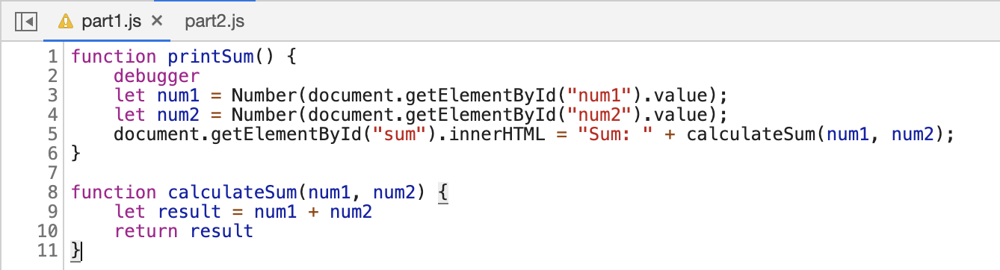

## DevTools - Debugging

Include the following screenshots:

* When the debugger is triggered, set a breakpoint at the initialization of the local variable result in calculateSum(). Take a screenshot of the list of breakpoints containing the breakpoint you just added.
* Add watch expressions to find the value of num1 and num2, and the data type of result. Take a screenshot of the watch expressions list.

Answer the following questions:
* What was the bug?
  * The bug is that `num1` and `num2` in the `printSum()` function are strings, causing the function `calculateSum(num1, num2)` to simly append `num2` to `num1`, rather than adding their numerical values.
* How would you fix it? Include a screenshot of your fix.
  * I fixed it by adding `Number()` before the two values, converting `num1` and `num2` into numbers.
  

## DevTools - Network Tab
