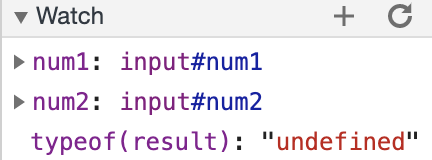

## DevTools - Debugging

Include the following screenshots:

* breakpoints:  

* watch expressions list:   
  

Answer the following questions:
* What was the bug?
  * The bug is that variables `num1` and `num2` in the `printSum()` function are strings, causing the function `calculateSum(num1, num2)` to simply append `num2` to `num1`, rather than adding their numerical values.
* How would you fix it? Include a screenshot of your fix.
  * I fixed it by adding `Number()` before the two values, converting `num1` and `num2` into numbers.
  

## DevTools - Network Tab
1. What is the name of the new json file?
* citylots.json  
2. Which file initiated the download of the new file?
* part2.js  
3. What is its file size?
* 11.7 MB
4. How long did it take to download?
* 79 ms
5. What was your User-Agent for the browser that made the request?
* Mozilla/5.0 (Macintosh; Intel Mac OS X 10_15_7) AppleWebKit/537.36 (KHTML, like Gecko) Chrome/88.0.4324.96 Safari/537.36 
6. In the response, what type of server did it come from?
* Apache
7. When was the file last modified?
* Tue, 26 Jan 2021 22:14:13 GMT
8. What was the Content-Type of the file? 
* application/json 
9. Which method inside the initiating file made the request?
* `fetchData()`
